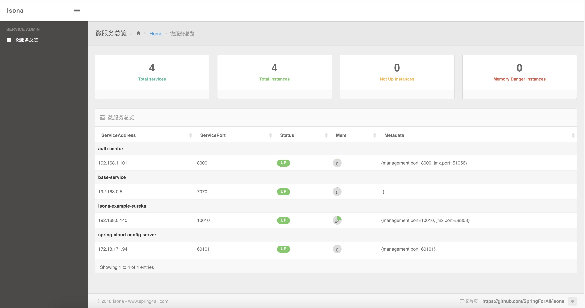

# Isona

这是一款基于Spring Boot与Spring Cloud构建的微服务管理工具。一个类似于Spring Boot Admin的轮子，但该项目不仅仅是一个轮子，后续将会对接spring4all社区版的微服务脚手架应用实现对使用了Spring Cloud构建的微服务系统全面的监控管理等功能。



支持我们就给我们`Star`吧！更多内容，请持续关注我们的社区：[spring4all.com](http://www.spring4all.com)

## 主要成员

- [程序猿DD](http://blog.didispace.com)
- **招募有志之士ing!!!**

## 功能简介

- 基于Spring Cloud体系的微服务总览
- Spring Boot Actuator各端点信息的可视化视图
- 更多内容待开发...

## 使用说明

**注意：由于目前还是测试版，并未提交各依赖包到中央仓库。用户可git clone本项目，然后在本地编译之后，按如下步骤使用！**

该项目的使用方向简单，如果没有个性化定制需要，只需要按如下操作就能马上启动一个Isona来对您使用Spring Cloud构建的微服务系统实现管理。

- 第一步：创建一个基础的Spring Boot应用
- 第二步：`pom.xml`中引入如下以来：

```xml
<dependency>
	<groupId>com.spring4all</groupId>
	<artifactId>isona-web</artifactId>
	<version>0.0.1-SNAPSHOT</version>
</dependency>

<dependency>
	<groupId>org.springframework.cloud</groupId>
	<artifactId>spring-cloud-starter-eureka</artifactId>
</dependency>

<dependency>
	<groupId>com.h2database</groupId>
	<artifactId>h2</artifactId>
</dependency>
```

- 第三步：编写应用主类，具体如下：

```java
@EnableEurekaIsonaServer
@SpringBootApplication
public class EurekaIsonaApplication {

	public static void main(String[] args) {
		SpringApplication.run(EurekaIsonaApplication.class, args);
	}

}
```

> Tips：如果使用consul做注册中心的话，只需要替换下面两个地方即可：
> - 将`spring-cloud-starter-eureka`的依赖换成：`spring-cloud-starter-consul-discovery`
> - 将`@EnableEurekaIsonaServer`换成：`@EnableConsulIsonaServer`

## 更多配置

。。。
